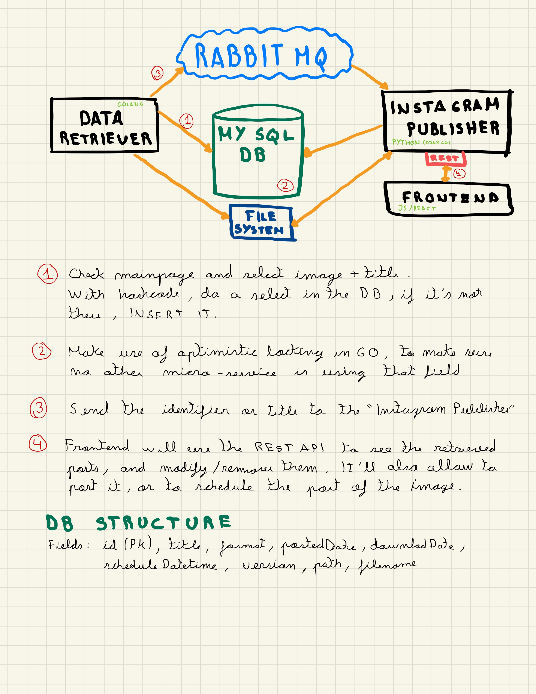

# GoRedditScrapper

This project is to automatize the image download from Reddit and automatically publish it to Instagram.

It follows a microservice architecture (overkill I know!) where the first microservice is responsible of downloading the images, the second one checks the db and publishes the images. 
It also will have some endpoints to be able to schedule publish times, select the images that you want to be uploaded...
Then, the last part will be developing the frontend.

Right now, the first microservice is up and running, working smoothly. It has the ability to download from reddit image service, gyfcat and Imgur (maybe I'll add some more in the future). 

I'd like to add some kind of repeated posts detection (hashing the file), as of right now I only check that the filename is not the same. 
It has a routine to download images every X time (added some randomness to not be detected by reddit!).

The connection between microservices wll be done by AMQ (again, overkill), and the first microservice will inform the publisher one.
Maybe in a future this communication won't be needed as the scheduling is supposed to be ran on the publisher, but as of right now it will follow a master-slave pattern, where the downloader will guide the publisher.

I may try developing the second (publisher) in both GoLang and Python, just to try out. Frontend maybe I try React, but not really interested on this last part.

